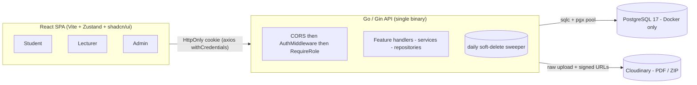
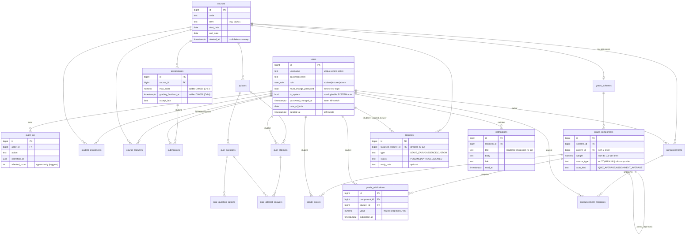
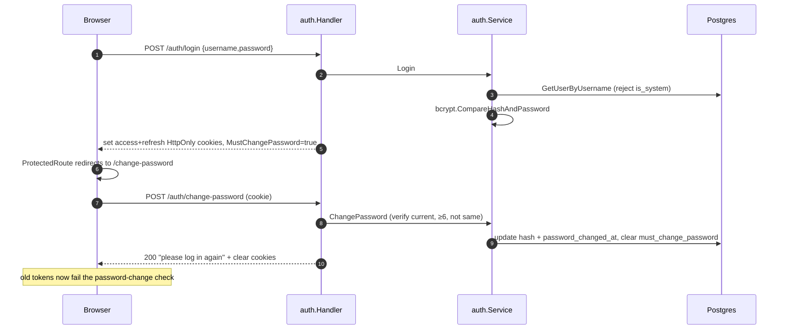

# myIU-lite — Architecture

This document describes how myIU-lite is built: the system shape, the backend layering, the data model, the request lifecycle, and the cross-cutting subsystems. For *why* each choice was made, see [`DECISION_LOGS.md`](./DECISION_LOGS.md) (referenced inline as `D-NN`).

---

## 1. System context

One Go/Gin API binary, one PostgreSQL database, one React SPA, and Cloudinary for uploaded files. Three actors — Student, Lecturer, Admin — distinguished by a `role` carried in a JWT cookie. There is **no email**: all cross-actor communication is the persisted `notifications` table and the `requests` round-trip.



- **Style:** Feature-Oriented Monolith (`D-10`) — see §2.
- **Stateless auth:** JWT in HttpOnly cookies; no session store (`D-11`, `D-13`).
- **Postgres via Docker only** (`PD-H`, `D-08`); migrations are incremental per phase (`D-06`, 000001–000008).

---

## 2. Backend layering

The backend is organized **by business feature, not by technical layer** (`D-10`). Each feature folder under `backend/internal/` keeps the same three-way split:

| File | Responsibility | Rule |
|------|----------------|------|
| `handler.go` | HTTP transport: parse path/JSON, read identity from context, map errors → status + JSON envelope, register routes | No business logic, no SQL |
| `service.go` | Business rules + authorization/ownership checks, transaction orchestration, same-tx notification writes | The only place rules live |
| `repository.go` | DB access via the sqlc-generated `*db.Queries` | No business rules |

Supporting files per feature: `dto.go` (request/response structs + `errorEnvelope`), `model.go` (sentinel errors), and `*_test.go` (real-Postgres integration tests).

### Features (all registered in `cmd/api/main.go`)

| Feature (`internal/…`) | Responsibility |
|------------------------|----------------|
| `auth` | login / refresh / logout / `me` / change-password; mints & parses JWT cookies |
| `auditlogs` | append-only admin audit log read API + the `WriteAudit` helper |
| `users` | admin account CRUD, CSV import of students/lecturers, password reset |
| `courses` | admin course CRUD (incl. soft-delete) + lecturer course-student reads |
| `enrollments` | admin CSV import / removal of students & lecturers per course |
| `assignments` | assignment authoring, versioned submissions (Cloudinary), grading, finalize |
| `quizzes` | quiz authoring, attempts, auto-grading |
| `grades` | weighted grade scheme, MANUAL/AUTO scores, live compute, frozen publications |
| `announcements` | immutable course announcements with fan-out delivery |
| `requests` | directed student→lecturer requests + single reply |
| `notifications` | the persisted fan-out primitive — list / unread-count / mark-read (no producer endpoints; produced inline by the features above) |
| `lifecycle` | the daily soft-delete sweeper (a background ticker, not an HTTP feature) |
| `shared` | cross-cutting infra: `config`, `db` (sqlc output), `middleware`, `auth` (JWT), `authz` (membership asserts), `cloudinary`, `health`, `testutil` |

Cross-feature dependencies are allowed where business rules need them (e.g. the gradebook reads quiz attempts and submissions); there is no hard bounded-context enforcement and no abstractions added purely for purity (`D-10`, Ponytail).

---

## 3. Request lifecycle

Every authenticated route runs the same chain. Protected feature routes are registered under an `api := r.Group("/api"); api.Use(AuthMiddleware)` group, with role subgroups (`api.Group("/lecturer").Use(RequireRole(...))`), so authentication always runs **before** role-gating.

```mermaid
sequenceDiagram
    autonumber
    participant B as Browser SPA
    participant C as CORS
    participant AM as AuthMiddleware
    participant RR as RequireRole
    participant H as Handler
    participant SV as Service
    participant R as Repository
    participant PG as Postgres

    B->>C: request + access_token cookie
    C->>AM: allowed origin (credentials)
    AM->>PG: GetUserByID (validate token, not deleted)
    Note over AM: reject token older than last password change (D-13); forced-reset allow-list (D-15)
    AM->>RR: c.Set user_id, c.Set role
    RR->>H: role in allow-list? else 403
    H->>SV: parsed input + user_id from JWT (never from body)
    SV->>SV: authz.AssertCourseMember / ownership check
    SV->>R: query / mutate
    R->>PG: SQL
    PG-->>SV: rows
    SV-->>H: result or sentinel error
    H-->>B: JSON DTO, or {"error":{"code","message"}}
```

Identity always comes from the JWT-derived `user_id`/`role` set by `AuthMiddleware` — **never** from a client-supplied id in the body or query. Errors use a uniform `{"error":{"code","message"}}` envelope.

---

## 4. Data model

PostgreSQL, evolved across migrations `000001`–`000008` (incremental per phase, `D-06`). Two tables are **soft-deleted** (`users`, `courses` — `deleted_at`, `D-29`/`D-40`); `audit_log` is **append-only** (enforced by DB triggers, `D-35`); `announcements` and `requests` are immutable by convention (no `updated_at`, `D-61`/`D-63`).



*(Coursework/quiz tables — `submissions`, `quizzes`, `quiz_questions`, `quiz_question_options`, `quiz_attempts`, `quiz_attempt_answers` — and `student_enrollments` / `course_lecturers` / `grade_schemes` / `grade_scores` / `announcements` / `announcement_recipients` are shown by their relationships; see the migrations in `backend/db/migrations/` for full column lists.)*

Key integrity points: one immutable `grade_schemes` row per course (`UNIQUE(course_id)`, `D-65`); `grade_components.parent_id` is a self-FK limited to 2 levels with per-level sum-to-100 validated in the service; partial unique indexes enforce one active username (`users_username_active_uq`) and one in-progress quiz attempt per student.

---

## 5. Cross-cutting subsystems

### JWT / RBAC (`shared/auth`, `shared/middleware`)
`Mint`/`Parse` issue HS256 tokens with custom `Claims{Role, Type}` (`WithValidMethods(["HS256"])`). Login mints a 15-min **access** and a 7-day **refresh** token, both **HttpOnly + SameSite=Lax** cookies (`D-11`, `D-12`). `AuthMiddleware` validates the token, loads the user, rejects soft-deleted users, rejects tokens minted before the last password change (`iat < password_changed_at`, `D-13`), and enforces the forced-first-login allow-list (`D-14`, `D-15`). `RequireRole` gates each route group by role. CSRF relies on browser-native defences (HttpOnly + SameSite + strict CORS), no token (`D-23`).

### Persisted fan-out notifications + same-transaction write (`notifications`)
A notification is **never** a separate endpoint — it is inserted **inside the producing transaction**:
`pool.Begin → qtx := q.WithTx(tx) → mutate domain row → qtx.InsertNotification(...) → tx.Commit`.
A forced rollback leaves **neither** the domain row **nor** the notification. Used by assignment grading (`D-55`), grade publish/republish (one per affected student, `D-59`/`D-66`), announcement fan-out (`D-60`), and request create/reply (`D-63`). Rows store fully-rendered `title`/`body` at creation, so they survive later resource changes (`D-53`); the header bell + list page consume them (`D-54`).

### CSV import discipline (`enrollments`, reused by `users` and `grades`)
Whole-file validation **before any write**, all-or-nothing commit in one transaction, per-row `{row, field, message}` errors, **HTTP 422** on any failure, no partial imports (`D-27`). Reused for account import, enrollment/lecturer assignment (`D-30`/`D-32`), and one-component-per-file grade import (`D-67`).

### Cloudinary raw upload (`shared/cloudinary`)
PDF/ZIP submissions upload with `ResourceType:"raw"`, `Type:"authenticated"`; downloads use 5-minute signed private URLs (`PD-D`). Handlers validate real MIME (first 512 bytes) + extension and enforce the 10 MB cap before upload.

### Soft-delete sweep (`lifecycle`)
A startup catch-up run plus a daily `time.Ticker` (panic-recovered) runs, in one transaction, `UPDATE courses SET deleted_at = now() WHERE deleted_at IS NULL AND end_date < now() - interval '1 month'`, and writes a single `COURSE_SWEEP` audit row (only when ≥1 row changed) as the `__system__` actor (`D-37`/`D-38`/`D-39`). Idempotent; no cascade — dependents are hidden via the active-course gate (`D-40`).

### Forced first-login & audit log
Every account ships `must_change_password = true`; the middleware allows only change-password/logout/me until it's cleared, and a successful change stamps `password_changed_at` (invalidating outstanding tokens) and forces re-login (`D-16`). Admin mutations write a single audit row each (bulk ops carry `operation_id` + `affected_count`, `D-33`/`D-34`) via `WriteAudit` **inside the same transaction**; the table is physically append-only (`D-35`) and admin-only to read (`D-36`). Lecturer actions (grades, announcements, replies) are deliberately **not** audit-logged.

---

## 6. Representative flows

### (a) Login + forced password change



### (b) Request reply — same-transaction mutation + notification (`D-63`/`NOTIF-02`)

```mermaid
sequenceDiagram
    autonumber
    participant B as Lecturer Browser
    participant RH as requests.Handler
    participant RS as requests.Service
    participant PG as Postgres
    B->>RH: POST /api/lecturer/requests/:id/reply {decision, note}
    Note over RH: AuthMiddleware + RequireRole(lecturer); lecturerID from JWT
    RH->>RS: ReplyRequest
    RS->>PG: GetRequestByID (404 / not-targeted / already-closed guards)
    RS->>PG: BEGIN
    RS->>PG: ReplyRequest (status, reply_note, replied_at) — guarded WHERE status='PENDING'
    RS->>PG: InsertNotification (recipient=student, REQUEST_REPLIED)
    RS->>PG: COMMIT
    Note over RS,PG: request update + notification land together, or neither
    B-->>B: student later sees it via the bell / GET /notifications
```

The grade-publish flow is structurally identical but loops over every enrolled student, writing one publication snapshot + one notification each inside a single transaction.

---

## 7. Tech stack & versions

**Backend** (`backend/go.mod`, Go 1.24.0):

| Library | Version | Role |
|---------|---------|------|
| Gin | v1.11.0 | HTTP framework |
| pgx | v5.7.2 | Postgres driver + pool |
| sqlc | build-time (`sqlc.yaml`, `sql_package: pgx/v5`) | SQL → type-safe Go |
| golang-migrate | v4 (CLI) | schema migrations |
| golang-jwt/jwt | v5.3.1 | access/refresh tokens |
| x/crypto (bcrypt) | cost 12 | password hashing |
| cloudinary-go/v2 | v2.16.0 | raw file storage |
| gin-contrib/cors | v1.7.6 | credential-aware CORS |
| caarlos0/env, godotenv | v11 / v1.5 | typed `.env` config |
| gabriel-vasile/mimetype | v1.4 | upload MIME sniffing |
| testify | v1.11 | tests/assertions |

**Frontend** (`frontend/package.json`):

| Library | Version | Role |
|---------|---------|------|
| React / react-dom | 19.x | UI |
| Vite | 6.x | build/dev |
| TypeScript | 5.7 | language |
| react-router | 8.x | role-guarded routes |
| Zustand | 5.x | auth/UI state |
| @tanstack/react-query | 5.x | server state |
| axios | 1.x | HTTP + 401/403 interceptor |
| react-hook-form + zod | 7.x / 4.x | forms + validation |
| shadcn/ui + Tailwind | Radix / v4 | components + styling |
| sonner, lucide-react, date-fns | — | toasts, icons, dates |

---

## 8. Build, test & CI

- **`scripts/check.sh`** — the local Definition-of-Done gate: `golangci-lint` (pinned v1.64.8), `go build`, `go vet`, then (with `DATABASE_URL` set) `migrate up` + `go test -count=1 -p 1 ./...`, then frontend `eslint` + `tsc -b && vite build`. It **fails loudly** if `DATABASE_URL` is unset (no silent skip).
- **Real-Postgres tests** — integration tests run against an actual `postgres:17` DB with migrations applied; `-p 1` serializes package binaries because the suite shares one DB and one test briefly renames the `notifications` table (see README → Testing).
- **Pre-push hook** — `.githooks/pre-push` runs `check.sh`; enable once per clone with `git config core.hooksPath .githooks`.
- **GitHub Actions `ci`** — on every PR and push to `main`: spins a `postgres:17-alpine` service, installs golang-migrate, runs migrations, `golangci-lint`, `go test -p 1 ./...`, then frontend lint + build. Merge into `main` is gated on this job (`PD-I`).
